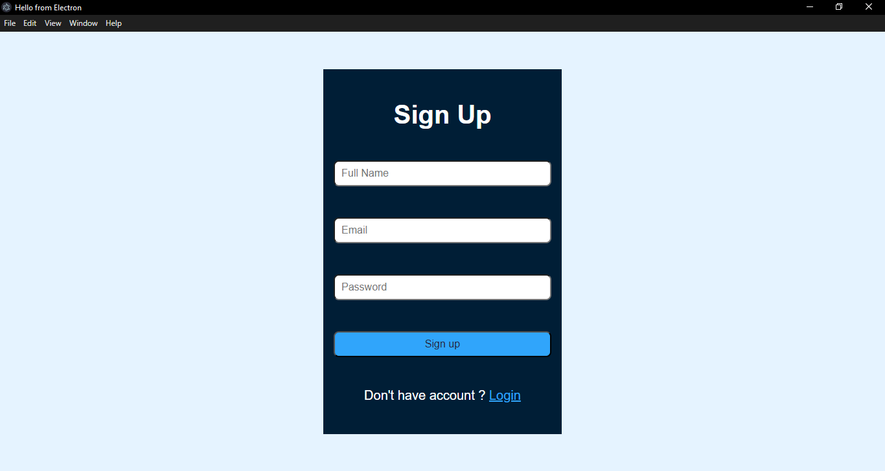
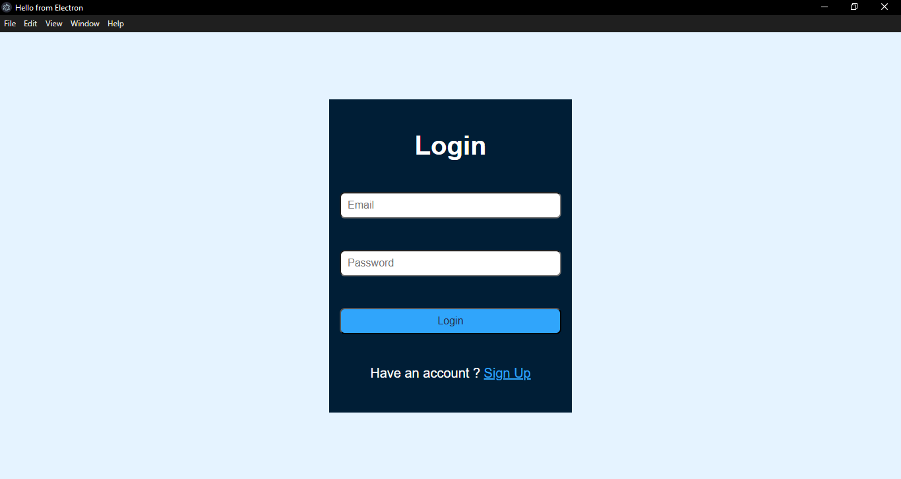
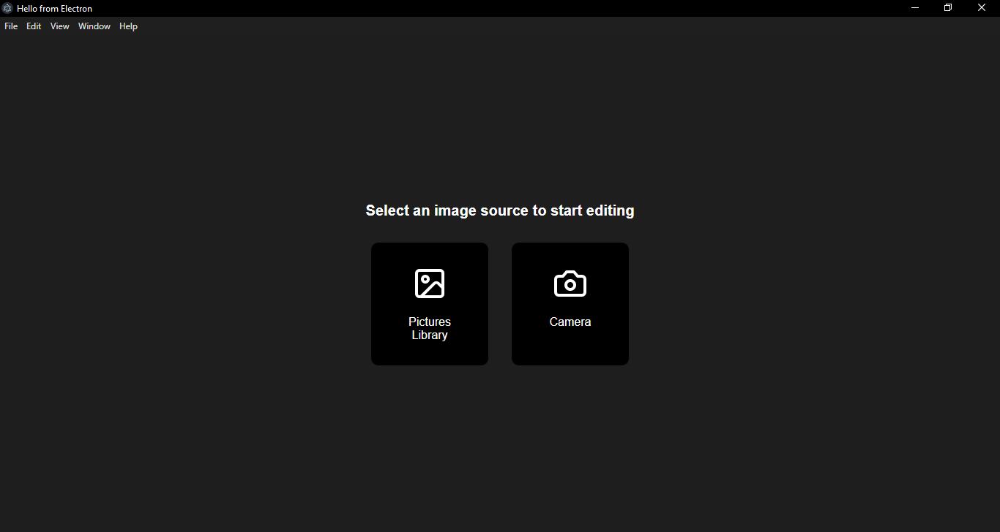
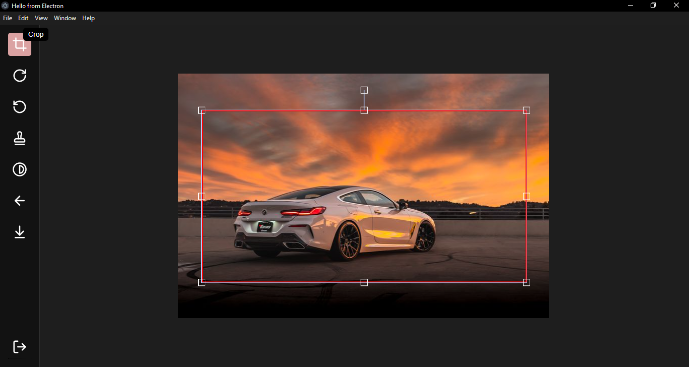
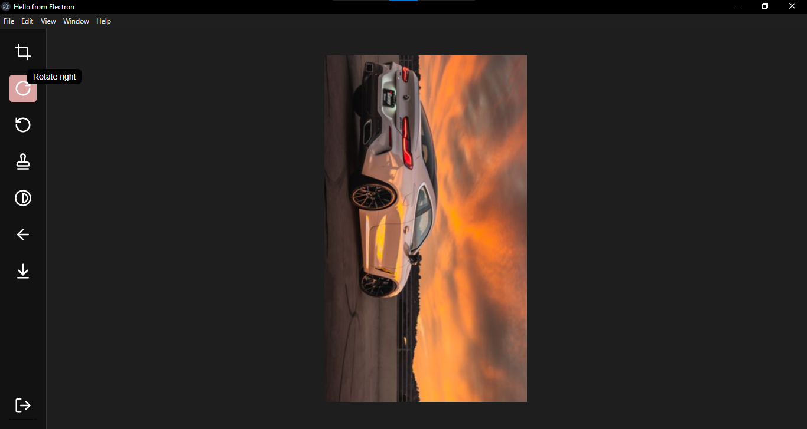
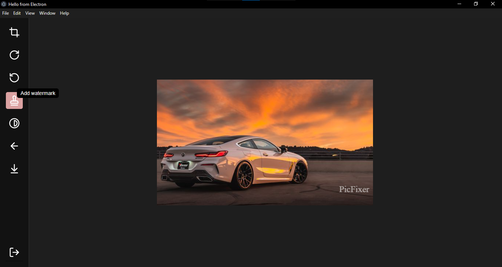
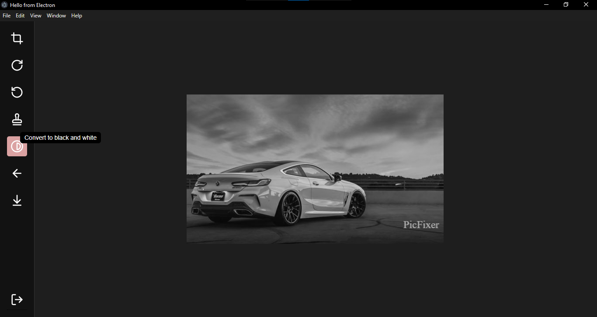
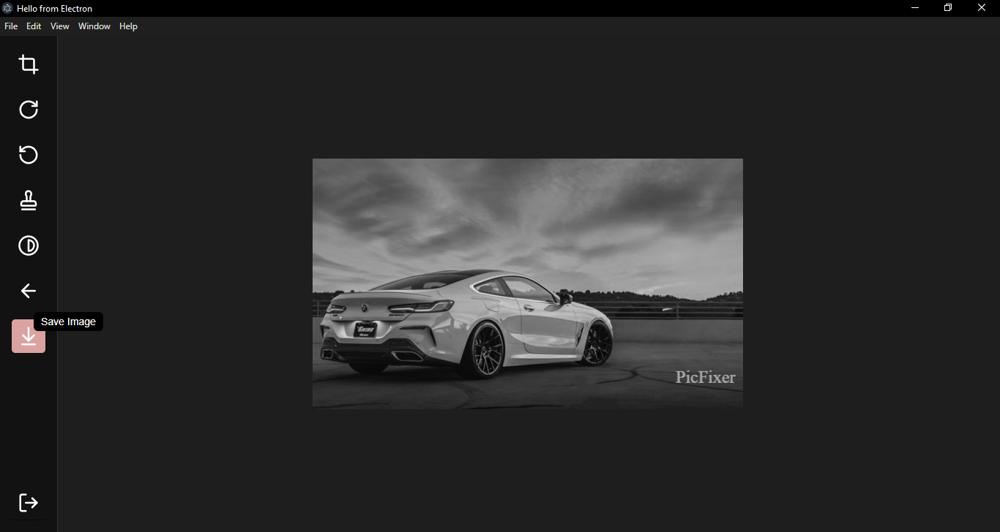

# PicFixer


A powerful desktop image editing application built with React, Electron, and Laravel.

## Table of Contents

- [Project Overview](#project-overview)
- [Features](#features)
  - [User Authentication](#user-authentication)
  - [Image Management](#image-management)
  - [Image Editing Capabilities](#image-editing-capabilities)
- [Tech Stack](#tech-stack)
- [Installation and Setup](#installation-and-setup)
  - [Local Development Setup](#local-development-setup)
  - [Docker Deployment](#docker-deployment)
- [Usage Instructions](#usage-instructions)
- [Project Structure](#project-structure)
- [API Documentation](#api-documentation)
- [Contributing Guidelines](#contributing-guidelines)
- [License](#license)

## Project Overview

PicFixer is a cross-platform desktop application designed for efficient image editing. It provides users with a suite of essential image manipulation tools in an intuitive interface. The application combines the power of React for the frontend, Laravel for the backend API, and Electron to deliver a seamless desktop experience.

## Features

### User Authentication

- **Signup**: Create a new account with email verification
- **Login**: Secure authentication with session management

### Image Management

- **Local Storage Selection**: Browse and select images from your computer
- **Camera Capture**: Take photos directly using your device's camera
- **Multiple Format Support**: Works with JPG, PNG, GIF, and other common formats

### Image Editing Capabilities

- **Crop**: Precisely trim images to desired dimensions
- **Rotate**: Rotate images left or right in 90-degree increments
- **Watermark**: Add a watermark to the image
- **Black & White Conversion**: Transform colored images to grayscale
- **Save**: Export edited images in various formats and quality settings

## Tech Stack

### Frontend

- **React**: UI component library
- **Redux**: State management
- **Fabric.js**: Canvas manipulation
- **Electron**: Desktop application wrapper

### Backend

- **Laravel**: PHP framework for API development
- **Sanctum**: API authentication

### Database

- **MySQL**: Data storage for user information and preferences

### Deployment

- **Docker**: Containerization for consistent deployment

## Installation and Setup

### Prerequisites

- Node.js (v14+)
- PHP (v8.0+)
- Composer
- MySQL
- Docker and Docker Compose (for containerized deployment)

### Local Development Setup

1. **Clone the repository**

   ```bash
   git clone https://github.com/hassanaboukhalil/PicFixer.git
   cd picfixer
   ```

2. **Backend Setup**

   ```bash
   cd server
   composer install
   cp .env.example .env
   php artisan key:generate
   ```

3. **Configure Database**

   - Update the `.env` file with your database credentials

   ```bash
   php artisan migrate
   php artisan serve
   ```

4. **Frontend Setup**

   ```bash
   cd ../client
   npm install
   ```

5. **Run the Application**

   ```bash
   # Development mode
   npm run dev

   # Build Electron app
   npm run build
   ```

### Docker Deployment

1. **Build and start containers**

   ```bash
   docker-compose up -d --build
   ```

2. **Access the application**
   - The API will be available at `http://localhost:8000`
   - The frontend will be available at `http://localhost:3000`

## Usage Instructions

### Authentication

1. **Sign Up**: Launch the application and click "Sign Up" to create a new account
   

2. **Login**: Enter your credentials on the login screen
   

### Image Editing

1. **Select Image**: Click "Select Image" and choose from your local storage or use the camera option to capture a new photo
   

2. **Edit Image**: Use the main interface to access editing tools
   

3. **Crop Image**: Select the crop tool and adjust the selection area
   

4. **Rotate Image**:

   - Left rotation
     
   - Right rotation
     

5. **Add Watermark**: add a watermark to the image
   

6. **Convert to Black & White**: Apply grayscale filter to your image
   

7. **Save Image**: Export your edited image with custom settings
   

## Project Structure

```
picfixer/
├── client/                 # React/Electron frontend
│   ├── public/             # Static assets
│   ├── src/                # React source code
│   │   ├── components/     # UI components
│   │   ├── redux/          # State management
│   │   ├── services/       # API integration
│   │   └── utils/          # Helper functions
│   ├── electron/           # Electron configuration
│   └── package.json        # Dependencies and scripts
│
├── server/                 # Laravel backend
│   ├── app/                # Application code
│   │   ├── Http/           # Controllers, Middleware, Requests
│   │   ├── Models/         # Database models
│   │   └── Services/       # Business logic
│   ├── database/           # Migrations and seeders
│   ├── routes/             # API routes
│   └── composer.json       # PHP dependencies
│
├── docker/                 # Docker configuration
│   ├── nginx/              # Nginx configuration
│   ├── php/                # PHP configuration
│   └── mysql/              # MySQL configuration
│
├── docker-compose.yml      # Docker services definition
└── README.md               # Project documentation
```

## API Documentation

### Authentication Endpoints

#### Login

- **URL**: `/api/login`
- **Method**: `POST`
- **Parameters**:
  - `email`: User's email address
  - `password`: User's password
  - `ip`: Client IP address (optional)
  - `latitude`: Location data (optional)
  - `longitude`: Location data (optional)
- **Response**: User data with authentication token

#### Signup

- **URL**: `/api/signup`
- **Method**: `POST`
- **Parameters**:
  - `name`: User's full name
  - `email`: User's email address
  - `password`: User's password
  - `ip`: Client IP address (optional)
  - `latitude`: Location data (optional)
  - `longitude`: Location data (optional)
- **Response**: User data with authentication token

## Contributing Guidelines

1. Fork the repository
2. Create a feature branch (`git checkout -b feature/amazing-feature`)
3. Commit your changes (`git commit -m 'Add some amazing feature'`)
4. Push to the branch (`git push origin feature/amazing-feature`)
5. Open a Pull Request

### Coding Standards

- Follow PSR-12 for PHP code
- Use ESLint for JavaScript/React code
- Write unit tests for new features

## License

This project is licensed under the MIT License - see the LICENSE file for details.

---
